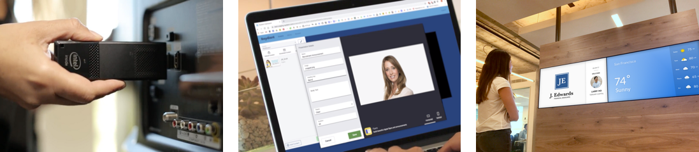

# RaydiantKit

 

RaydiantKit is [Raydiant's](https://www.raydiant.com) screen signage SDK. Raydiant apps are offline-first React applications that can be configured and published through the [Raydiant Dashboard](https://dash.raydiant.com).

Inspired by [create-react-app](https://github.com/facebook/create-react-app), RaydiantKit makes it easy to develop screen signage applications with zero build configuration.

---

[Documentation](https://raydiant-kit.raydiant.com/)

Demos:
[Video Player](https://raydiant-kit-video-example.netlify.com) ·
[Weather](https://raydiant-kit-weather-example.netlify.com) ·
[Menu](https://raydiant-kit-menu-example.netlify.com)

[Contributing Guidelines](CONTRIBUTING.md)

---

