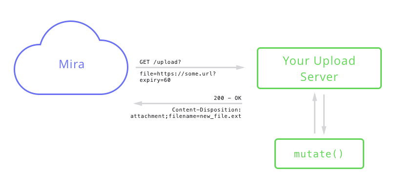
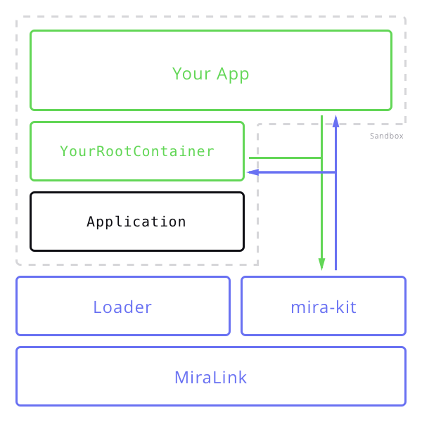

# mira-kit
Mira's digital display SDK. This document will discuss the various components both necessary and optionally available to apps written for MiraLink devices.

Mira apps are primarily responsible for the visual rendering of presentations created by the user. Your app also defines the structure of those presentations, and this structure allows users to create presentations for your app in the Mira dashboard.

## Table of Contents
1. [The App Bundle](#the-app-bundle)
  - [An Information Dictionary](#an-information-dictionary)
  - [Icons and Thumbnails](#icons-and-thumbnails)
  - [Localizable Strings](#localizable-strings)
  - [The Executable](#the-executable)
  - [Upload Extensions](#upload-extensions)
1. [The App Life Cycle](#the-app-life-cycle)
  - [The Structure of an App](#the-structure-of-an-app)
  - [States for Apps](#states-for-apps)
1. [Deploying an App](#deploying-an-app)
1. [Core APIs](#core-apis)

## The App Bundle
```bash
/your-app
  info.json
  strings.json
  icon.svg
  thumbnail.svg
  bundle.js
```

### An Information Dictionary
The `info.json` file contains metadata about your app, which the system uses to interact with your app. This information primarily includes presentation properties, the values of which are set by your users when creating presentations. The dictionary also includes its presentation type, which is used by the system to identify both your app and which presentations it should be launched with.

#### `info.json` Keys

| Key Name | Value Type | Description |
| -------- | ---------- | ----------- |
| `presentation_type` | `string` | An identifier in the form of `company.app_name`. This must be unique.
| `presentation_properties` | `list` | A list of property definitions. The user-defined values constitute a "presentation" and will be passed to your app on launch.
| `allowed_request_domains` | `list` | A list of domains your app will need to access via HTTP/HTTPS.
| `requires_file_access` | `boolean` | Whether or not your app requires access to files uploaded for your app by your users. This value should be `true` for any app with a property of type `file`.
| `requires_local_store` | `boolean` | Whether or not your app requires access to local storage. Apps are currently limited to a small and variable amount of local storage.
| `embedded_url_format` | `string` | __Optional.__ A URL format using URL-param syntax: `https://my.service/:some_id?some_flag=:some_flag`. Used for embedded first- and second-party apps only.

#### Property Definitions
Presentation property definitions are dictionaries that require that you specify the property's `name` and `type`, as well as any optional values that may alter the property's presentation in the Mira dashboard. The possible types of properties are:

- `string`: A short-form string.
  - `secure`: boolean, optional. Secure strings are displayed as password-style inputs.
- `text`: A long-form string.
- `datetime`: A date and time.
  - `format`: string, required. A [Moment.js](http://momentjs.com/docs/#/parsing/string-format/)-style format string.
- `boolean`: A true or false value.
- `number`: A numerical value.
- `selection`: A series of options.
  - `exclusive`: boolean, optional. Prevents multiple selection.
  - `options`: list, required.
    - `name`: string, required.
    - `value`: string, required.
- `file`: A file upload.
  - `webhook`: string, optional. The URL endpoint of an [upload extension](#upload-extensions).
- `link`: A clickable link. Takes no user value.
  - `url`: string, required. The URL to open when clicked.

For example, an Instagram app may have the property `ig_username`:
```json
{"name": "ig_username", "type": "string", "secure": false}
```

The text that is displayed in the dashboard for each property is derived from your app's `strings.json` file.

### Icons and Thumbnails
Your app icon is used to represent your app in the Mira dashboard and should be `32pt` square. Its thumbnail is used to represent presentations created for your app and should be `110pt` wide by `62pt` tall. Both files should be SVGs.

_FIXME: Should include Sketch template._

### Localizable Strings
Localizable text must be placed in a `strings.json` file. The dictionary should map the ISO 639-1 language abbreviation to a dictionary mapping arbitrary string keys to readable, localized values. Using our earlier example, the Instagram app should have a `string.json`:

```json
{
  "en": {
    "ig_username": "Instagram Username"
  },

  "fr": {
    "ig_username": "Nom d'Utilisateur Instagram"
  }
}
```

This file should also include translations of any user-facing text for your app, and will be passed to your app at runtime.

### The Executable
The executable file contains your app's transpiled and bundled code. All markup, styling, and logic must be bundled into this file using webpack, Browserify, or some other bundler. The name of this file should be `bundle.js`. At its top-most level, the file should export a subclass of `React.Component`. If `embedded_url_format` is present in your `info.json`, the runtime will _ignore your `bundle.js`_ and instead fill the format with the presentation's property values and load the result in an iframe-like context. The executable can safely be omitted in this case.

### Upload Extensions
If your app defines a `file` property, it may provide a `webhook` endpoint for mutation of any user-uploaded files. This endpoint points to your server, which should accept HTTP GET requests with the `file` query parameter set to a URL pointing the the uploaded file. This URL will expire, so the likely first thing your server should do in response is download the file.

The response to this request should set the `Content-Disposition` header to the format `attachment; filename=$FILENAME.EXT`, and return the mutated version of the file as an attachment. Alternatively, your server may respond without an attachment and with a `304` status code, indicating no change. Any other response will be treated as an error.



## The App Life Cycle
### The Structure of an App
At the heart of every Mira app is the `Application` component, whose job is to facilitate the interactions between the system and your app. On startup, the system loads the `Application` with the current presentation, the properties of which are loaded into your app.

Your app is evaluated and imported at runtime, and the exported subclass of `React.Component` is considered your root container, and the entry point into your app. An instance of your root container is created and mounted into the React document with the following properties:

- `strings`, a representation of your app's `strings.json` file. To access a readable string, simply render `strings.your_key_name`, and the correct value will be chosen based on the language at runtime.

Additionally, each entry in `presentation_properties` will be passed as a property of your root container. These are the list of properties corresponding to your app's presentation properties, and the values associated with the current presentation.

The `Application` component, your root container, and your entire app will be evaluated, run, and displayed from within a sandboxed context. This sandbox cannot access to the device or browser in which it's presented, and many APIs present in typical browser contexts, such as `XMLHttpRequest`, have been removed in favor of this SDK's [core APIs](#core-apis). These APIs take into account your app's `info.json` configuration and adjusts access accordingly.



### States for Apps
Overall, life-cycle of your app will be reflected in the [mounting life-cycle](https://facebook.github.io/react/docs/component-specs.html#lifecycle-methods) of your root component. Your root component may also implement an additional life-cycle method, which will be called periodically by the MiraLink.

```js
void componentDidReceiveHeartbeat()
```

This method may be used to trigger content or layout updates.

Transition between apps typically occurs at the end of a presentation. The MiraLink uses the deployed schedule and playlist to determine which presentation should be shown next, and the app in which to present it. The MiraLink will also make a best effort to pre-cache your app's source to increase launch performance.

However, when a user deploys a new schedule to the device, your app may no longer be the scheduled app, and playback might be interrupted. The system is not currently constructed to allow for any grace period, and in these cases interruption of your app will be immediate. Therefore it's paramount that your app strives for statelessness where possible, and atomic action when not.

## Deploying an App
When you register as a Mira developer, you will receive a developer secret. This secret should not be published anywhere, and will be used in conjunction with a webhook to deploy new versions of your app. After registering your app with Mira, you'll receive a webhook endpoint that, when used as post-commit hook in GitHub, will trigger our deploy service to clone and deploy the `HEAD` of your repository. The file structure of this repository must conform to the structure laid out in [the application bundle](#the-app-bundle) section.

## Core APIs
### [MiraResource](./request/README.md)
The `MiraResource` class and related classes provide an API for making HTTP and HTTPS requests. Each object represents a request for a specific URL, following redirects if necessary. Requests are limited to allowed domains and file access specified in your app's `info.json` .

### MiraLocalStorage
_Coming Soon_

### MiraHDMIAccess
_Coming Soon_

### MiraBluetoothAccess
_Coming Soon_

### MiraLocationAccess
_Coming Soon_

### MiraPeerConnectivity
_Coming Soon_
