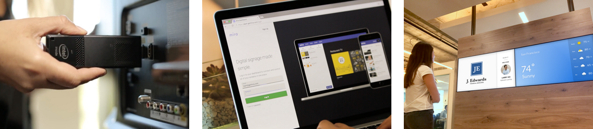

# MiraKit

 

MiraKit is [Mira's](https://getmira.com) screen signage SDK. Mira apps are offline-first React applications that can be configured and published through the [Mira Dashboard](https://dash.getmira.com).

Inspired by [create-react-app](https://github.com/facebook/create-react-app), MiraKit makes it easy to develop screen signage applications with zero build configuration.

---

[Documentation](https://mira-kit.getmira.com/)

Demos:
[Video Player](https://mira-kit-video-example.netlify.com) ·
[Weather](https://mira-kit-weather-example.netlify.com) ·
[Menu](https://mira-kit-menu-example.netlify.com)

[Contributing Guidelines](CONTRIBUTING.md)

---

