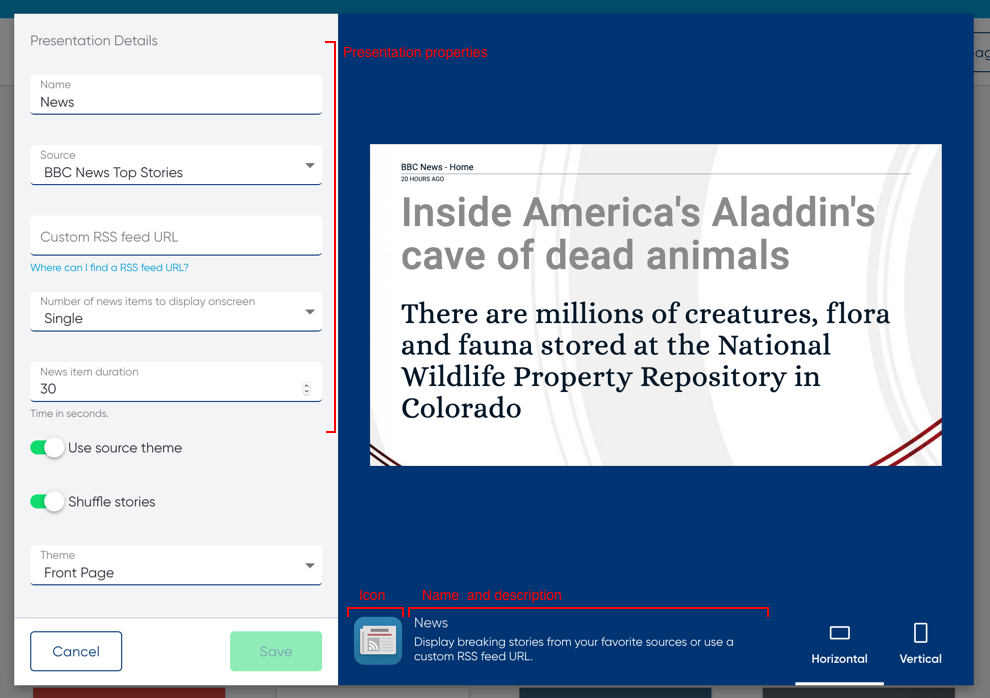
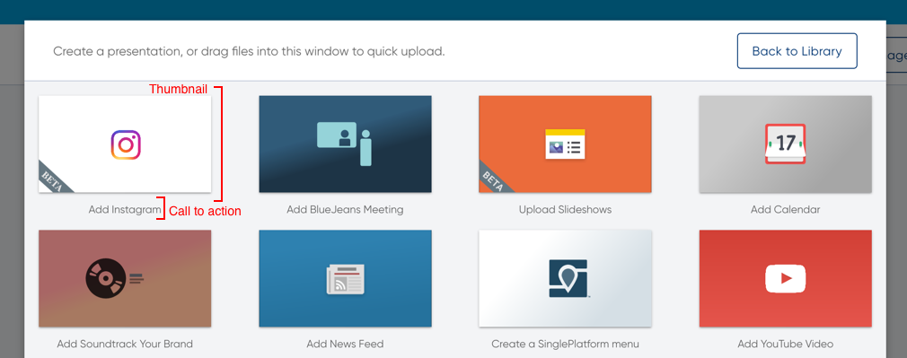

# Introduction

RaydiantKit is [Raydiant's](https://www.raydiant.com) screen signage SDK. Raydiant apps are offline-first React applications that can be configured and published through the [Raydiant Dashboard](https://dash.raydiant.com).

Inspired by [create-react-app](https://github.com/facebook/create-react-app), RaydiantKit makes it easy to develop screen signage applications with zero build configuration.

This document assumes you have some experience with [React](https://reactjs.org/) and [async / await](https://developer.mozilla.org/en-US/docs/Web/JavaScript/Reference/Statements/async_function).

---

[View on Github](https://github.com/mirainc/raydiant-kit) ·
[Video App](https://raydiant-kit-video-example.netlify.com/) ·
[Weather App](https://raydiant-kit-weather-example.netlify.com/) ·
[Menu App](https://raydiant-kit-menu-example.netlify.com/)

# Installation and Setup {#install}

RaydiantKit requires [Node 8](https://nodejs.org/en/) or higher. Run `node --version` to make sure you are running a compatible version.

To create and run your first Raydiant app, run the following commands:

```js
npx create-raydiant-app my-app  
cd my-app
npm start
```

The [`npx`](https://www.npmjs.com/package/npx) command comes installed with Node 5.2+ and will download the `create-raydiant-app` cli and bootstrap your first Raydiant app. Run `npm start` to start the app in the RaydiantKit development environment.

You don't need to install Webpack, Babel or ESLint — RaydiantKit conveniently handles all the build configuration for you.

Running `create-raydiant-app my-app` will scaffold a new app inside a directory called `my-app` with these files:

```
my-app
├── src
|   └── index.js
|   └── styles.css
├── raydiant.config.js
├── package.json
├── icon.svg
└── thumbnail.svg
```

# Commands {#commands}

Useful npm (or [yarn](https://yarnpkg.com/en/)) commands you can run from the app directory:

##### `npm start`

Runs your app in the simulator for local development.

##### `npm run build`

Bundles a production build of your app to `/build`. Run this before deploying.

##### `npm run deploy`

Deploys a new version of your app from `/build`.

##### `npm run static`

Output the app and simulator as a static site to `/static`. Useful for sharing a test page before deploying.

##### `npm run test`

Runs the [jest](https://facebook.github.io/jest/) test suite against files ending in `.test.js`.

# withRaydiantApp {#with-raydiant-app}

The entry file for Raydiant apps is `src/index.js` and it must export your app wrapped in the `withRaydiantApp` [higher-order component](https://reactjs.org/docs/higher-order-components.html):

```js
// src/index.js
import { withRaydiantApp } from 'raydiant-kit';

const App = ({
  presentation,
  isPlaying,
  playCount,
  onReady,
  onComplete,
  onError,
}) => {
  // ...
};

export default withRaydiantApp(App);
```

Wrapping your app in `withRaydiantApp` will inject these props into your app.

| Prop         | Type       | Definition                                                                                                                                     |
| ------------ | ---------- | ---------------------------------------------------------------------------------------------------------------------------------------------- |
| presentation | `object`   | An instance of your application with the user-defined name and values.<br/>ie. `{ name: 'Weather', values: { city: 'San Francisco' } }`        |
| isPlaying    | `boolean`  | Starts at `false` and becomes `true` when your app is visible.                                                                                 |
| playCount    | `number`   | Starts at `0` and increments on every play when your app is looping.                                                                           |
| onReady      | `function` | Call this when your app is ready to be displayed, typically after fetching initial data.                                                       |
| onComplete   | `function` | Call this when your app has finished displaying, typically after an event like `videoend` or a user-defined duration.                          |
| onError      | `function` | Call this with an [Error](https://developer.mozilla.org/en-US/docs/Web/JavaScript/Reference/Global_Objects/Error) object when your app errors. |

# Configuration {#configuration}

All Raydiant apps have a `raydiant.config.js` file to specify how it appears in the Dashboard.

```js
// raydiant.config.js
export default {
  name: 'Weather',
  description: 'Display local weather conditions.',
  callToAction: 'Add Weather',
};
```

### Config Options {#config-options}

| Option       | type     | Description                                                                              |
| ------------ | -------- | ---------------------------------------------------------------------------------------- |
| name         | `string` | The display name of your app.                                                            |
| description  | `string` | The description of your app.                                                             |
| callToAction | `string` | The text to display in the app selector.                                                 |
| properties   | `object` | Defines the inputs of your application that appear in the presentation builder.          |
| simulator    | `object` | Simulator-only options. (See the [Simulator](#simulator) section for available options.) |

### Adding an Icon and Thumbnail {#adding-icon-thumbnail}

To upload an icon and thumbnail, add an `icon.svg` and `thumbnail.svg` to the root directory of your app.

<div style="display: flex; max-width: 400px;">
  <div style="margin-right: 10px;">
    
  </div>
  <div>
    
  </div>
</div>

### Properties {#properties}

Presentation properties define how the user can configure your app from the Dashboard. Use RaydiantKit prop types and their modifiers to create the presentation builder experience.

```js
// raydiant.config.js
import PropTypes from 'raydiant-kit/prop-types';

export default {
  name: 'Weather',
  description: 'Display local weather conditions.',
  callToAction: 'Add Weather',
  properties: {
    city: PropTypes.string('City')
      .required()
      .helperText('eg. San Francisco, US')
    duration: PropTypes.number('Duration')
      .min(15)
      .default(15)
      .helperText('Time in seconds.')
  },
};
```

All prop types inherit common _modifiers_ for required inputs, default values and helper text / links. The first argument of every prop type is the label of the input.

```js
string('YouTube Video ID')
  .helperText('Where do I get my video id?')
  .helperLink('https://lmgtfy.com/?q=youtube+video+id')
  .default('bWeWIOoMllM')
  .required();
```

```js
string('Heading Text').maxLength(200);
```

```js
text('Body Text').maxLength(400);
```

```js
number('Duration')
  .min(10)
  .max(300);
```

```js
boolean('Mute');
```

```js
selection('Theme')
  .option('light', 'Light')
  .option('dark', 'Dark');
```

```js
image('Image');
```

```js
video('Video').maxSize(2000000); // In bytes.
```

```js
file('PDF').contentTypes(['application/pdf']);
```

```js
// The first argument is the plural label and the second is the singular label.
array('Categories', 'Category')
  .items({
    name: string('Category'),
    items: array('Items', 'Item').items({
      name: string('Item'),
      price: number('Price'),
    }),
  })
  .maxItems(10);
```

Check out [Menu](#menu) for an example of using array types.

### Simulator {#simulator}

Running `npm start` from your app directory will start the Raydiant app simulator. You can test various presentation values in the simulator using the `presentations` option:

```js
// raydiant.config.js
export default {
  // ...
  simulator: {
    presentations: [
      {
        name: 'San Francisco',
        values: { city: 'San Francisco, US', units: 'imperial' },
      },
      {
        name: 'Toronto',
        values: { city: 'Toronto, CA', units: 'metric' },
      },
      {
        name: 'Sydney',
        values: { city: 'Sydney, AU', units: 'metric' },
      },
      {
        name: 'Not Found',
        values: { city: 'Not found' },
      },
      { name: 'New Presentation' },
    ],
  },
};
```

The active presentation is injected into your app's props:

```js
// src/index.js
import { withRaydiantApp } from 'raydiant-kit';

const Weather = ({ presentation, isPlaying, onReady, onComplete, onError }) => {
  // presentation = {
  //   name: 'San Francisco',
  //   values: {
  //     city: 'San Francisco, CA',
  //     units: 'imperial',
  //     duration: 10,
  //   }
  // }
  // ...
};

export default withRaydiantApp(Weather);
```

# File Uploads {#file-uploads}

Raydiant apps can use files uploaded through the Dashboard. To accept files, your app must define a file presentation property.

```js
// raydiant.config.js
import { image, video, file } from 'raydiant-kit/prop-types';
export default {
  // ...
  properties: {
    image: image('Image'),
    video: video('Video'),
    pdf: file('PDF').contentTypes(['application/pdf']),
  },
};
```

The url of the upload will be available on the file prop.

```js
// src/index.js
import React from 'react';
import { withRaydiantApp } from 'raydiant-kit';

// Render the image and call onReady when it has loaded.
const PictureApp = ({ presentation, onReady }) => (
  
);

export default withRaydiantApp(PictureApp);
```

#### Local Files {#local-files}

You can test local files by adding them to a `files` directory in the root directory of your app. The relative url can be referenced from your simulator presentations.

```js
// raydiant.config.js
export default {
  // ...
  simulator: {
    presentations: [{ name: 'Video', values: { url: 'video.mp4' } }],
  },
};
```

Check out [Video Player](#video-player) for an example of handling file uploads.

# Environment Variables {#environment-variables}

Environment variables are injected at build time and must be prefixed with `RAYDIANT_APP_` to access them in your app.

You can add environment variables in a `.env` file in the root directory the app.

```bash
# .env
RAYDIANT_APP_WEATHER_API_KEY=key
```

```js
// src/index.js
const apiKey = process.env.RAYDIANT_APP_WEATHER_API_KEY;
```

You can also add environment specific environment variables.

* `.env.development` will be loaded when running the simulator for local development.
* `.env.production` will be loaded when building for deployment.
* `.env.test` will be loaded when running the test suite.

`.env` files should be checked into source control because they should not contain any values that can't be injected into client code.

# Browser Support {#browser-support}

The Raydiant device runtime is [Chromium](https://www.chromium.org/) based so at minimum your app needs to support the latest version of Chrome. It is also recommended that you also develop your app against the Chrome browser.

The Raydiant Dashboard will also load a preview of your app while creating or editing a presentation and supports [Chrome](https://www.google.ca/chrome/), [Safari](https://support.apple.com/downloads/safari), [Edge](https://www.microsoft.com/en-ca/windows/microsoft-edge) and [IE11](https://www.microsoft.com/en-ca/download/internet-explorer-11-for-windows-7-details.aspx). Your app should work with these browsers or provide graceful fallbacks if they don't.

# Deploying to the Dashboard {#deploying-to-dashboard}

RaydiantKit is currently in _closed beta_, contact [support@raydiant.com](mailto:support@raydiant.com?subject=RaydiantKit%api%token%20and%20app%20id) and request an API token and app id to deploy your app.

# Examples

The examples are published so you can play around with them online. To run them locally you will need to [install yarn](https://yarnpkg.com/en/docs/install) and clone the repository.

```bash
git clone git@github.com:raydiant/raydiant-kit.git
yarn
cd examples/weather
yarn start
```

## Video Player {#video-player}

Displays a user-uploaded video. Demos file uploads.

[Demo](https://raydiant-kit-video-example.netlify.com) ·
[Source](https://github.com/mirainc/raydiant-kit/tree/master/examples/video-player)

## Weather {#weather}

Fetches local weather data for a specified city. Demos data fetching, in-animations and environment variables.

[Demo](https://raydiant-kit-weather-example.netlify.com) ·
[Source](https://github.com/mirainc/raydiant-kit/tree/master/examples/weather)

## Menu {#menu}

Display a table of menu items. Demos array types.

[Demo](https://raydiant-kit-menu-example.netlify.com) ·
[Source](https://github.com/mirainc/raydiant-kit/tree/master/examples/menu)
